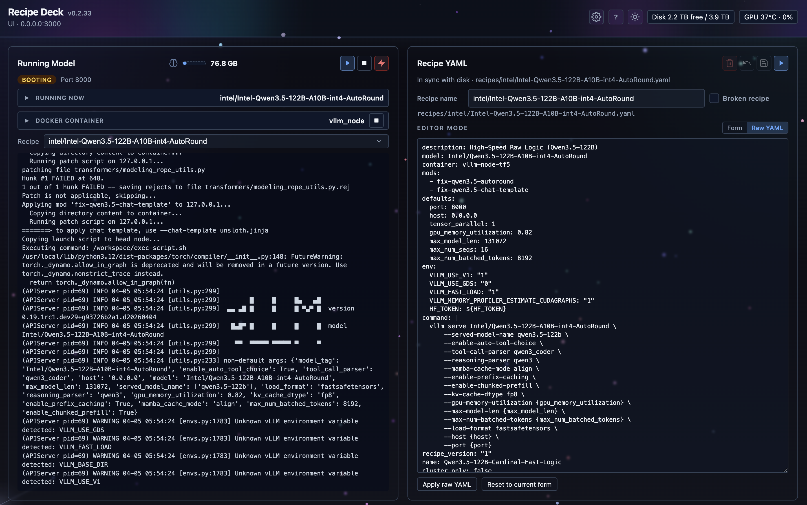

# Recipe Deck

**Recipe Deck** is an operator web UI aimed at **NVIDIA DGX Spark**–class systems—the **GB10** and **Asus GX10** (Spark family) line, and equivalent Spark-style inference boxes. It is **not** a replacement for the inference stack: deployment **requires** **[spark-vllm-docker](https://github.com/eugr/spark-vllm-docker)** on the same host. This repo does not ship vLLM, models, or `run-recipe.py`; it orchestrates that tree, runs **one** vLLM-backed model at a time via `run-recipe.py`, streams logs, edits recipe YAML, and manages `HF_TOKEN` and related settings.

The app is a **single Node.js process** that serves a **React (Vite)** front end, **REST** control plane, and **WebSocket** log stream. It is typically run **natively** with **systemd** on the inference host—not containerized in v1.

## Screenshot



---

## Table of contents

- [Screenshot](#screenshot)
- [Features](#features)
- [Requirements](#requirements)
- [Stack](#stack)
- [Repository layout](#repository-layout)
- [Which configuration file?](#which-configuration-file)
- [First run (development)](#first-run-development)
- [First run (production + systemd)](#first-run-production--systemd)
- [Local development](#local-development)
- [Configuration](#configuration)
- [npm scripts](#npm-scripts)
- [Production build](#production-build)
- [Deployment](#deployment)
  - [Via SSH](#via-ssh)
  - [Local (on the inference host)](#local-on-the-inference-host)
- [API](#api)
- [WebSocket](#websocket)
- [Security and network](#security-and-network)
- [Troubleshooting](#troubleshooting)
- [Documentation](#documentation)
- [Upstream](#upstream)
- [License](#license)
- [Reporting security issues](#reporting-security-issues)
- [Contributing](#contributing)

---

## Features

- Recipe list with **most-recently-used** ordering (persisted run counts).
- Start/stop a single runner; **slot `a`** is the only supported slot (legacy `b` is rejected).
- Live **log** view with bounded memory and optional rolling files.
- Edit **recipe YAML** from the UI; optional **HF_TOKEN** merge when the recipe omits it.
- **Settings** for ports, Python path, ready-line regex, timeouts, and polling—written to the same env files the stack uses; restart Recipe Deck to apply.
- Best-effort **metrics**: disk space under `SPARK_VLLM_ROOT`, `nvidia-smi`, vLLM `/metrics` (tok/s), OpenAI-compatible `/v1/models`, and optional **`docker ps`** to match image/container to the listening port.
- **UI:** Frosted **glass** panels; **floating dots** background (focal point follows the pointer over the page, smooth drift when the pointer is not over the page; **`prefers-reduced-motion`** uses a static focal point). **Simple UI** in Settings disables the dots and header aurora.

---

## Requirements

- **Hard dependency — [spark-vllm-docker](https://github.com/eugr/spark-vllm-docker):** Recipe Deck expects a checkout on the **same machine** (see **`SPARK_VLLM_ROOT`**) with `run-recipe.py`, `recipes/*.yaml`, and the Python environment that stack needs. Without it, there is nothing to run or configure.
- **Node.js 20+** (uses `fs.statfs`, `fetch`, modern TS).
- **Target hardware (intended):** **DGX Spark** **GB10** / **Asus GX10** (Spark family) and similar hosts—i.e. the class of boxes this UI was built around, not arbitrary generic servers (though the code may run elsewhere if you wire paths yourself).
- Optional: **`nvidia-smi`** for GPU info; vLLM **HTTP `/metrics`** for throughput.
- Optional: **`docker`** on `PATH` with permission to run **`docker ps`** so the UI can show image and container name for the process bound to the vLLM port.

---

## Stack

| Layer | Technology |
|--------|------------|
| UI | React 19, Vite 6, CSS Modules |
| Server | Express, `ws`, TypeScript → `dist/server` |
| Config | `dotenv`, YAML for recipes |

Shared types live under `types/`; see [docs/ARCHITECTURE.md](docs/ARCHITECTURE.md) and [docs/UI.md](docs/UI.md) for UI conventions.

---

## Repository layout

| Path | Role |
|------|------|
| `client/` | Vite + React; `client/src/api/client.ts` for HTTP/WS; `client/src/constants/` for shared URLs; **`client/src/components/README.md`** describes UI folders (`shell/`, `recipe/`, `runner/`, etc.) |
| `server/` | Express app, WebSocket hub, slot controller, routes, metrics |
| `types/` | Shared TypeScript types |
| `docs/` | Architecture and operator-local deploy notes |
| `docs/systemd/` | Example **user** systemd unit |
| `scripts/deploy-gb10.sh` | Rsync + remote install/build/restart (optional; see [Deployment](#deployment)); **`deploy-gx10.sh`** is a legacy alias |
| `scripts/setup.sh` | Interactive env bootstrap ([Local development](#local-development)); **`npm run setup`** |

---

## Which configuration file?

| Goal | File | Notes |
|------|------|--------|
| App runtime (ports, **`SPARK_VLLM_ROOT`**, logs, etc.) | **`.env`** at repo root (from **`.env.example`**) | Read by the Node process and by **`EnvironmentFile=`** in systemd. |
| Deploy from another machine over SSH | **`operator.local.env`** (from **`operator.local.env.example`**) | **Gitignored.** Only used by **`scripts/deploy-gb10.sh`** for **`DEPLOY_SSH`** and **`DEPLOY_REMOTE_PATH`**. Does **not** replace **`.env`** on the server. |

---

## First run (development)

1. Clone this repo and **[spark-vllm-docker](https://github.com/eugr/spark-vllm-docker)** on the same machine you will run the stack.
2. **`cd`** to the recipe-deck repo root.
3. Run **`./scripts/setup.sh`** (no Node required) or **`npm run setup`** after **`npm install`**, and enter the absolute path to your spark-vllm-docker checkout when prompted (it checks for **`run-recipe.py`**).  
   Or manually: copy **`.env.example`** → **`.env`** and set **`SPARK_VLLM_ROOT`**.
4. **`npm install`** — use **`npm install`** for local dev (updates lockfile if needed); use **`npm ci`** for clean production installs (see [Production build](#production-build)).
5. **`npm run dev`**
6. Open **`http://127.0.0.1:<port>`** (see **`.env`**; default is often **3000**).

If the UI does not load, see [Troubleshooting](#troubleshooting). There is **no built-in authentication**; the dev server often binds to **all interfaces** unless **`SWITCHER_HOST=127.0.0.1`** — treat the service as **LAN-visible** unless you firewall or tunnel.

---

## First run (production + systemd)

1. On the **inference host**, install **[spark-vllm-docker](https://github.com/eugr/spark-vllm-docker)** and clone this repo (e.g. **`~/repos/recipe-deck`**).
2. **`./scripts/setup.sh`** to create **`.env`** and set **`SPARK_VLLM_ROOT`**, or copy **`.env.example`** → **`.env`** and edit by hand.
3. **`npm ci`** then **`npm run build`** (reproducible install from lockfile).
4. Copy **`docs/systemd/recipe-deck.service`** to **`~/.config/systemd/user/`**; set **`WorkingDirectory`**, **`EnvironmentFile=`**, and **`ExecStart`** to match your tree — if **`which node`** is not **`/usr/bin/node`** (e.g. **nvm** / **fnm**), use the **absolute** path to **`node`** in **`ExecStart`** (user units do not load your login **`PATH`**). Optional: **`./scripts/setup.sh --systemd-hint`** prints a suggested snippet.
5. **`systemctl --user daemon-reload`** && **`systemctl --user enable --now recipe-deck.service`**
6. Open **`http://<host>:<SWITCHER_PORT>`** (default **3000**). Restrict exposure (firewall, VPN, or **`SWITCHER_HOST=127.0.0.1`**) — there is **no built-in authentication** when bound to **`0.0.0.0`**.

If the service fails, see [Troubleshooting](#troubleshooting).

---

## Local development

Prefer **`./scripts/setup.sh`** once after clone to create **`.env`** and validate **`SPARK_VLLM_ROOT`**. Flags: **`--deploy`** (also configure **`operator.local.env`** for SSH deploy), **`--systemd-hint`** (print suggested systemd **`ExecStart`** paths).

```bash
npm install
# If you skipped setup.sh, clone https://github.com/eugr/spark-vllm-docker and set:
# export SPARK_VLLM_ROOT=/path/to/spark-vllm-docker
# optional: export LOG_DIR=$PWD/.recipe-deck-logs
npm run dev
```

Open **`http://127.0.0.1:<port>`** (see `.env.example`; default is often **3000**). The dev server typically binds to **all interfaces** unless you set **`SWITCHER_HOST=127.0.0.1`**.

---

## Configuration

**Required variable:** **`SPARK_VLLM_ROOT`** — absolute path to your **[spark-vllm-docker](https://github.com/eugr/spark-vllm-docker)** checkout (**`run-recipe.py`**, **`recipes/`**). Everything else in **`.env`** has defaults or is optional tuning; see **`.env.example`**.

1. Copy **`.env.example`** to **`.env`** at the repo root (or inject the same keys via the environment). Use **`./scripts/setup.sh`** to set **`SPARK_VLLM_ROOT`** safely.

2. Optional overrides: **`RECIPE_DECK_RECIPES_DIR`**, **`RECIPE_DECK_TEMP_DIR`**, **`RUN_RECIPE_PY`**, **`RUN_RECIPE_SH`** — defaults match a normal [spark-vllm-docker](https://github.com/eugr/spark-vllm-docker) tree layout; override in **`$SPARK_VLLM_ROOT/.env`** if paths differ. The **Settings** page shows resolved paths read-only.

3. **`$SPARK_VLLM_ROOT/.env`** can hold **`HF_TOKEN`**, port knobs, and other keys the launcher reads. Recipe Deck may merge **`HF_TOKEN`** into a temporary recipe copy when the YAML does not define `env.HF_TOKEN`. If the recipe already sets `env.HF_TOKEN`, that value is not overwritten.

4. **Run counts:** each successful **`POST /api/run`** increments a per–recipe-stem counter stored as **`recipe-run-counts.json`** under **`LOG_DIR`** (default on Linux: `~/.local/share/recipe-deck/logs`).

See **`.env.example`** for **`SWITCHER_PORT`**, **`LOG_DIR`**, log rotation, **`READY_REGEX`**, and related variables.

---

## npm scripts

| Script | Purpose |
|--------|---------|
| `npm run setup` | Runs **`./scripts/setup.sh`** — **`.env`** bootstrap, optional **`--deploy`** / **`--systemd-hint`** |
| `npm run dev` | `tsx watch` on `server/main.ts`; serves API + proxies Vite dev client |
| `npm run build` | `build:client` then `build:server` |
| `npm run build:client` | Vite production build → `client/dist` |
| `npm run build:server` | `tsc` for `server/` → `dist/server` |
| `npm start` / `npm run start:prod` | `node dist/server/main.js` |
| `npm run typecheck` | Typecheck server and client without emit |
| `npm run lint` | [ESLint](https://eslint.org/) on tracked TS (excludes **`demo/`**; zero warnings) |
| `npm run lint:fix` | ESLint with `--fix` |
| `npm run format` | [Prettier](https://prettier.io/) on TypeScript/CSS sources |
| `npm run demo:test` | Playwright capture (requires a local **`demo/`** tree; **gitignored**, not in clone) |
| `npm run demo:mov` | Encode the latest WebM to **`demo/recipe-deck-demo/Recipe-Deck-Demo.mov`** (same **`demo/`** requirement) |

---

## Production build

Use **`npm ci`** for production and CI so installs match **`package-lock.json`**. Use **`npm install`** for local development when you may change dependencies.

```bash
npm ci
npm run build
```

Run with **`SPARK_VLLM_ROOT`** (and other vars) set:

```bash
node dist/server/main.js
```

Ensure **`SWITCHER_HOST`**, **`SWITCHER_PORT`**, and **`LOG_DIR`** match your environment.

---

## Deployment

Two common flows: push the repo from **another machine over SSH** (scripted rsync + remote build), or **work directly on the inference host** where the app and systemd unit already live.

### Via SSH

Use this when you run commands from a **laptop or workstation** that can reach the target over SSH. The repo includes **`scripts/deploy-gb10.sh`** (GB10-class inference hosts — DGX Spark, Asus GX10, Dell, etc.; **`deploy-gx10.sh`** is a legacy alias): it **rsync**s the tree to the host (excluding `node_modules`, `.git`, **`.env`**, and **`operator.local.env`**), then **SSH**s in to run **`npm ci`**, **`npm run build`**, and **`systemctl --user restart recipe-deck.service`**.

**Operator-specific SSH and paths** — do **not** commit real SSH users or hostnames. Copy **`operator.local.env.example`** to **`operator.local.env`** (gitignored) and set:

- **`DEPLOY_SSH`** — `user@host` for the target machine (required unless you pass **`DEPLOY_HOST`** for a one-off).
- **`DEPLOY_REMOTE_PATH`** (optional) — path on the **remote** host, relative to remote `$HOME` (e.g. `repos/recipe-deck`) or absolute. Do **not** use `~` in that file; tilde expands on the machine running the deploy script, not on the target.

Example one-off deploy without a local env file:

```bash
DEPLOY_HOST=user@your-inference-host.example ./scripts/deploy-gb10.sh
```

**Rsync warning:** **`deploy-gb10.sh`** excludes **`.env`** so a **`--delete`** sync does not wipe production secrets. **Never** run raw **`rsync -avz --delete`** against the remote app tree without the same excludes unless you intend to remove **`.env`**.

Details: **[docs/OPERATOR-LOCAL.md](docs/OPERATOR-LOCAL.md)**.

### Local (on the inference host)

Use this when you are **already logged into** the machine that runs Recipe Deck (SSH session, local console, or inline terminal on the box) and the repo is already checked out there (e.g. **`$HOME/repos/recipe-deck`** matching your systemd **`WorkingDirectory`**).

1. Go to the repository root:

   ```bash
   cd /path/to/recipe-deck
   ```

   (Often **`~/repos/recipe-deck`** if you mirror the example layout.)

2. Optionally update sources (**`git pull`**, unpack a tarball, etc.) so the tree matches what you want to run.

3. Install dependencies and build:

   ```bash
   npm ci
   npm run build
   ```

4. Restart the app (user systemd unit):

   ```bash
   systemctl --user restart recipe-deck.service
   systemctl --user is-active recipe-deck.service
   ```

Ensure **`SPARK_VLLM_ROOT`** and other variables are still set for the service (typically via **`EnvironmentFile=`** pointing at **`%h/.../recipe-deck/.env`**). Editing **`.env`** on the host does not require rsync; restart the unit after changes.

### systemd (first-time setup)

Copy **`docs/systemd/recipe-deck.service`** to **`~/.config/systemd/user/`**, adjust **`WorkingDirectory`**, **`ExecStart`**, and **`EnvironmentFile=`** to your **`.env`**. If Node is not at **`/usr/bin/node`** (e.g. **nvm** / **fnm**), set **`ExecStart`** to the output of **`command -v node`** on that host — user systemd units do not load login-shell **`PATH`**. **`./scripts/setup.sh --systemd-hint`** prints a suggested snippet. Then:

```bash
systemctl --user daemon-reload
systemctl --user enable --now recipe-deck.service
```

The example unit may reference **`EnvironmentFile=%h/.../recipe-deck/.env`**. Use the **Via SSH** or **Local** flow above for subsequent deploys.

---

## API

| Method | Path | Notes |
|--------|------|--------|
| `GET` | `/api/state` | Runner snapshot (`slots.a`), metrics, recipes, listen display |
| `POST` | `/api/run` | Body: `{ slot: "a", recipeStem, solo, useBuffer?, yamlBuffer?, recipeOverrides? }`. Single runner; omit `slot` or use **`"a"`** |
| `POST` | `/api/stop`, `/api/force-kill` | `{ slot: "a" }` optional |
| `GET` | `/api/recipe?name=` | Read YAML under `recipes/` |
| `POST` | `/api/recipe/save` | Write YAML |
| `GET` / `POST` | `/api/settings/hf-token` | Read/write `HF_TOKEN` in `SPARK_VLLM_ROOT/.env` |
| `GET` / `POST` | `/api/settings/app` | Ports, `PYTHON`, `READY_REGEX`, timeouts, intervals (restart to apply) |
| `POST` | `/api/service/restart` | User systemd restart of the Recipe Deck unit (production; optional **`RECIPE_DECK_SYSTEMD_UNIT`**) |

---

## WebSocket

- **`GET /ws`** — JSON lines: `{ type: "log", ... }`, `{ type: "state", ... }` (see server implementation for full shapes).

---

## Security and network

- There is **no built-in authentication**. If **`SWITCHER_HOST=0.0.0.0`**, the UI and API are reachable on the LAN; restrict with firewall, VPN, or bind to **`127.0.0.1`** and use SSH port forwarding.
- Secrets belong in **`.env`** / **`$SPARK_VLLM_ROOT/.env`**, not in recipe YAML committed to git, when avoidable.
- In the web UI, **?** in the header opens **About** (version, upstream link, security expectations).

---

## Troubleshooting

| Symptom | Things to check |
|---------|-------------------|
| Service fails after deploy | Remote **`.env`** missing or wrong path: **`EnvironmentFile=`** in systemd; confirm **`deploy-gb10.sh`** did not delete `.env` (script excludes it). |
| Runner never **HEALTHY** | **`READY_REGEX`** matches your vLLM log line; increase timeouts in settings if the model is slow to load. |
| No Docker image/name in UI | Process user cannot run **`docker ps`**; or nothing publishes the expected port. |
| Wrong recipes list | **`SPARK_VLLM_ROOT`** and **`recipes/`** path; **`chokidar`** refresh on file changes. |

---

## Documentation

| Doc | Content |
|-----|---------|
| [docs/README.md](docs/README.md) | Index of docs in this folder |
| [docs/ARCHITECTURE.md](docs/ARCHITECTURE.md) | Data flow, modules, frontend rules |
| [docs/UI.md](docs/UI.md) | CSS tokens, glass surfaces, background canvas, UI DRY conventions |
| [docs/OPERATOR-LOCAL.md](docs/OPERATOR-LOCAL.md) | **`operator.local.env`**, **`deploy-gb10.sh`**, gitignored local identifiers |
| [docs/systemd/recipe-deck.service](docs/systemd/recipe-deck.service) | Example systemd user unit |

---

## Upstream

- **spark-vllm-docker:** [github.com/eugr/spark-vllm-docker](https://github.com/eugr/spark-vllm-docker)

Forge URL for this repo (if any) is **not** stored in tracked files; use **`git remote -v`** locally or optional **`GIT_REMOTE_SSH_URL`** in **`operator.local.env`** (see **`operator.local.env.example`**) for runbooks only.

---

## License

Recipe Deck is licensed under the **MIT License** — see [LICENSE](LICENSE).

Dependencies (see `package.json` / `package-lock.json`) remain under their respective licenses. [spark-vllm-docker](https://github.com/eugr/spark-vllm-docker) is a separate project; use it under its license when you deploy the stack.

The **`"private": true`** field in `package.json` only prevents accidental **`npm publish`**; this app is meant to be **cloned and run from source**, not installed as a global npm package.

---

## Reporting security issues

See [SECURITY.md](SECURITY.md) for reporting vulnerabilities and handling secrets.

---

## Contributing

See [CONTRIBUTING.md](CONTRIBUTING.md).
