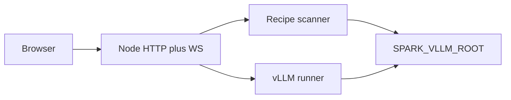

# Recipe Deck architecture

Recipe Deck targets **NVIDIA DGX Spark**–class hosts (**GB10**, **Asus GX10**, Spark family) and **requires [spark-vllm-docker](https://github.com/eugr/spark-vllm-docker)** on the same machine (`SPARK_VLLM_ROOT`). It is a **single Node.js process** on that host that serves a **React (Vite)** UI, **REST JSON** control plane, and a **WebSocket** stream for run logs. It spawns **at most one** `run-recipe.py` process at a time and tracks its state in a **SlotController** (stable wire id `a` in JSON: `slots.a`, `slot` in POST bodies).

**See also:** [README.md](../README.md) (operator overview, API table), [OPERATOR-LOCAL.md](OPERATOR-LOCAL.md) (deploy identities in gitignored env).

## High-level flow

1. **Discovery:** `recipes/*.yaml` under `SPARK_VLLM_ROOT/recipes` (with `chokidar` refresh).
2. **Run:** `python3 <SPARK_VLLM_ROOT>/run-recipe.py <recipe.yaml> --port <VLLM_PORT> [--solo]` with env merged from the host environment plus `SPARK_VLLM_ROOT/.env`. If the recipe YAML has no `env.HF_TOKEN`, Recipe Deck writes a **temporary YAML** that adds `HF_TOKEN` from that `.env` (so `run-recipe.py` still emits `export HF_TOKEN=...` in the launch script).
3. **Logs:** The runner appends stdout/stderr to a **bounded ring buffer** (UI + WS) and to **rolling files** under `LOG_DIR`.
4. **Health:** `BOOTING` until a line matches `READY_REGEX`, then `HEALTHY` until the process exits or the operator stops the run.
5. **Metrics (best-effort):** Disk free/total for `SPARK_VLLM_ROOT` (slow cadence), `nvidia-smi` snapshot, Prometheus scrape of `http://127.0.0.1:<port>/metrics` for tok/s when `HEALTHY`, **OpenAI-compatible** `GET http://127.0.0.1:<port>/v1/models` for served model IDs (same as `curl` from the LAN to `http://<inference-host>:<port>/v1/models`), and **`docker ps`** parsing to find the **image and container name** for the container that publishes that host port (requires Docker CLI access from the Recipe Deck process).

## Repository layout

| Area | Role |
|------|------|
| `types/` | Shared TypeScript types (no inline exported shapes elsewhere). |
| `server/` | Express app, WebSocket hub, slot controller, metrics, routes. |
| `client/` | Vite + React UI; **CSS Modules** only (no inline styling for layout/theme). Components live under **`client/src/components/`** in feature folders (`shell/`, `recipe/`, `runner/`, `metrics/`, `settings/`, `modals/`, `ui/`) — see **`client/src/components/README.md`**. |
| `docs/systemd/` | Example systemd unit for the inference host. |

## Frontend rules (summary)

- Styling: `*.module.css` per component; shared tokens in `client/src/styles/tokens.css`.
- Logic: hooks and API module (`client/src/api/client.ts`); no inline scripts in `index.html`.
- **UI details** (glass panels, background canvas, DRY constants): [docs/UI.md](UI.md).

### Background layer

- A full-viewport **canvas** (`FloatingDotsBackground`) renders colored dots and connector lines to a **focal point** that follows the pointer while it is over the document; when no pointer is tracked, the focal point **drifts** smoothly (respecting `prefers-reduced-motion`). **Simple UI** in settings disables this animation and the header aurora.

## Operational note

This control plane **does not** load models itself; GPU memory and inference are owned by vLLM processes started by `run-recipe.py`. Recipe Deck’s footprint should stay small: bounded logs, modest polling intervals, one child process at a time.

The HTTP server defaults to **`SWITCHER_HOST=0.0.0.0`** so the UI is reachable on the LAN. Use **`SWITCHER_HOST=127.0.0.1`** for loopback only; there is no built-in auth.
